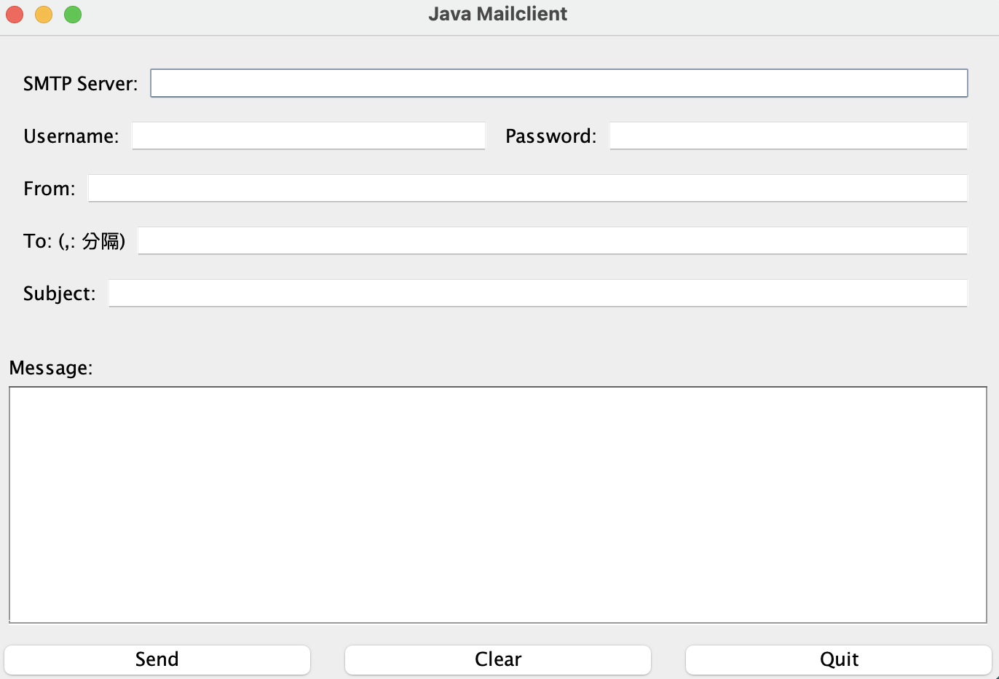
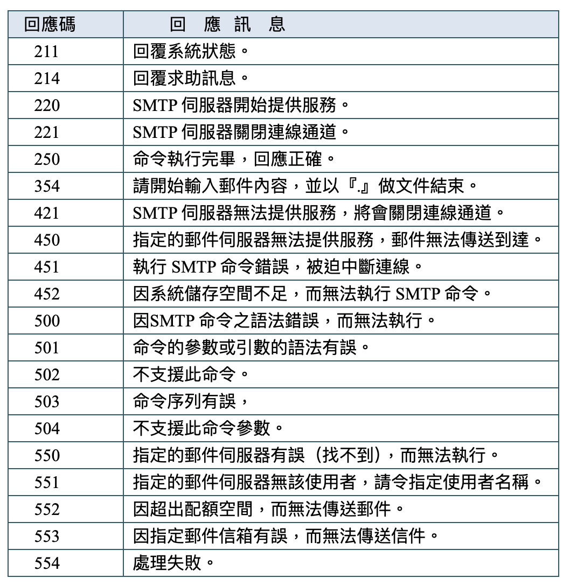

## 學號：M1325977

## 姓名：廖書賢

## 設置

_Requires Java 11 or greater._

## 啟動

### Windows

```
執行 Demo.exe
```

### Mac

```bash
java -jar Demo.jar
```

## 輸入範例

```
SMTP Server: smtp.gmail.com
Username: your@gmail.com
Password: your email app password # https://myaccount.google.com/apppasswords
From: xxx@gmail.com
To: xxx@gmail.com (支持多人)
Subject: 測試郵件
Message: 這是一封使用 Google SMTP 傳給您的測試郵件
```

## 介面



## 補充

### SMTP 回應碼



235: 用戶驗證成功

334: 等待用戶輸入驗證訊息

### SMTP 格式

- SMTP 響應通常以三位數字程式碼開始
- 如果響應跨多行，除最後一行外，每行的第 4 個字符是 "-"
